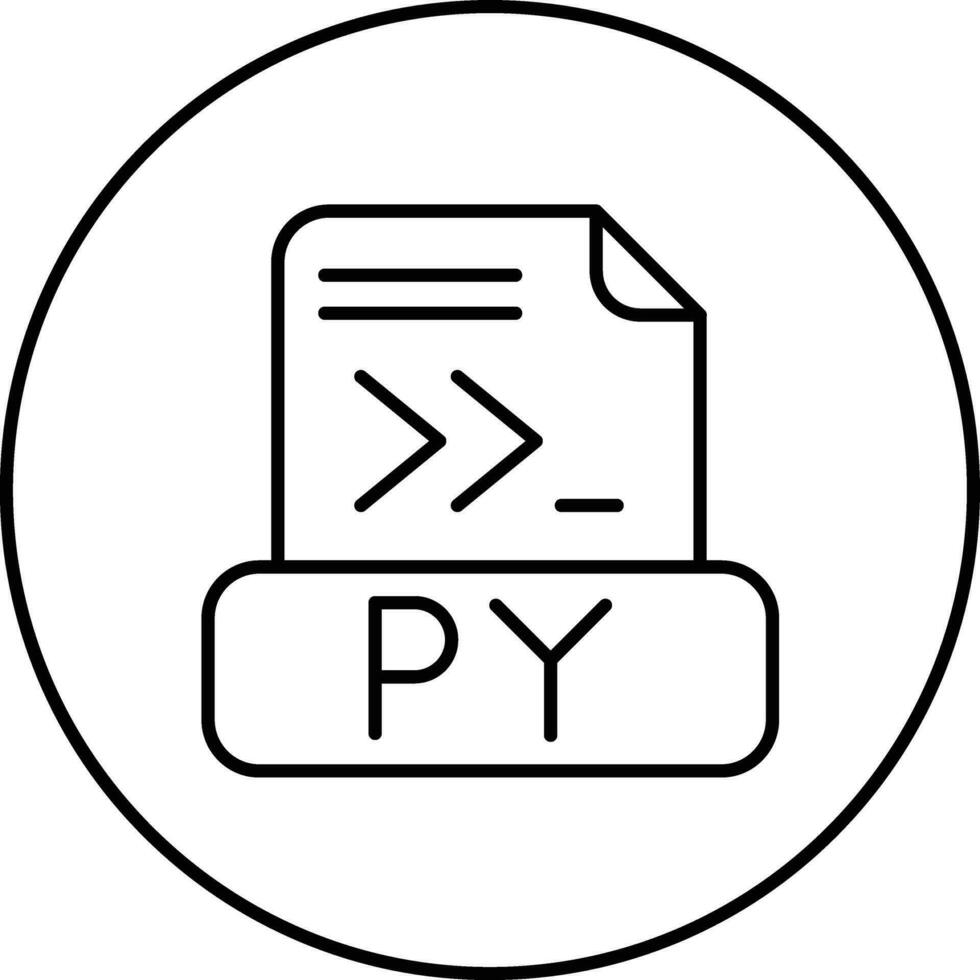

{width="100" .center}

# Music-py

## How to use

You can use the command line. For instance:

```bash
poetry run scales

┏━━━┳━━━━┳━━━━━┳━━━━┳━━━┳━━━━┳━━━━━┓
┃ I ┃ II ┃ III ┃ IV ┃ V ┃ VI ┃ VII ┃
┡━━━╇━━━━╇━━━━━╇━━━━╇━━━╇━━━━╇━━━━━┩
│ C │ D  │ E   │ F  │ G │ A  │ B   │
└───┴────┴─────┴────┴───┴────┴─────┘
```

In general, follow the usage below

```bash
poetry run scales [OPTIONS] [TONIC] [TONALITY]
tonic [TONIC] Scale tonic [default: C]
tonality [TONALITY] Scale tonality [default: major]
```

For other options, execute the `--hep` flag.
